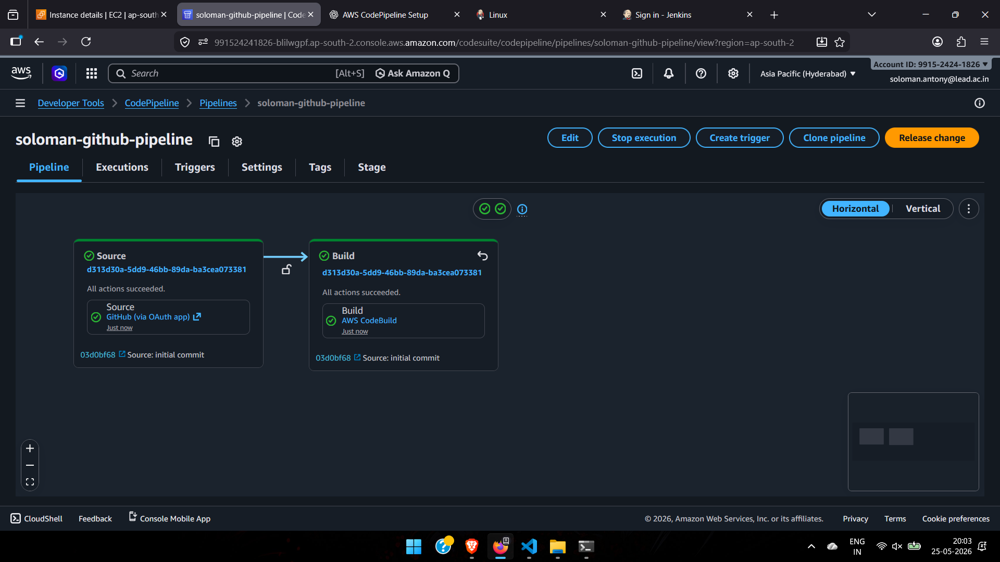
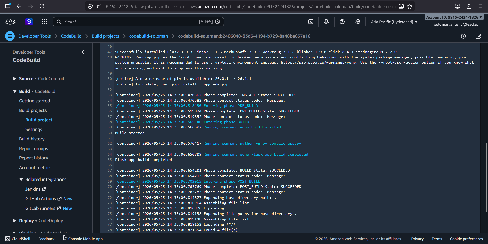

# AWS CodePipeline with GitHub Integration and CodeBuild Stage

## Objective

Configure an AWS CodePipeline with:

* GitHub integration
* AWS CodeBuild stage
* Automatic pipeline trigger on code changes

---

# Project Architecture

```text
GitHub Repository
        ↓
AWS CodePipeline
        ↓
AWS CodeBuild
        ↓
Build Artifacts (Amazon S3)
```

---

# Technologies Used

* AWS CodePipeline
* AWS CodeBuild
* Amazon S3
* GitHub
* Python Flask

---

# Repository Structure

```text
.
├── app.py
├── requirements.txt
├── buildspec.yml
├── pipeline.yaml
├── screenshots/
│   ├── pipeline.png
│   └── log.png
└── README.md
```

---

# Flask Application

## app.py

```python
from flask import Flask
from datetime import datetime

app = Flask(__name__)

@app.route("/")
def home():
    current_time = datetime.now().strftime("%Y-%m-%d %H:%M:%S")

    return f"""
    <h1>AWS CodePipeline Demo</h1>
    <p>Flask application deployed successfully!</p>
    <p>Current Time: {current_time}</p>
    """

if __name__ == "__main__":
    app.run(host="0.0.0.0", port=5000)
```

---

# requirements.txt

```text
Flask==3.0.3
```

---

# buildspec.yml

```yaml
version: 0.2

phases:
  install:
    commands:
      - echo Installing dependencies...
      - pip install -r requirements.txt

  build:
    commands:
      - echo Build started...
      - python -m py_compile app.py
      - echo Flask app build completed

artifacts:
  files:
    - '**/*'
```

---

# AWS CodePipeline Configuration

## Source Stage

* Source Provider: GitHub (Version 2)
* Repository: GitHub Repository
* Branch: main
* Trigger: Automatic on code push

## Build Stage

* Build Provider: AWS CodeBuild
* Environment: Ubuntu Linux
* Runtime: Standard
* Image: aws/codebuild/standard:7.0

## Artifact Store

* Amazon S3 bucket used for storing build artifacts

---

# Steps Performed

1. Created a GitHub repository.
2. Added Flask application files.
3. Created an S3 bucket for pipeline artifacts.
4. Configured AWS CodeBuild project.
5. Connected GitHub repository.
6. Created AWS CodePipeline.
7. Added Source and Build stages.
8. Enabled automatic trigger on GitHub push.
9. Executed the pipeline successfully.

---

# Screenshots

## Pipeline Execution



---

## Build Logs



---

# Output

* GitHub integration configured successfully.
* AWS CodeBuild executed successfully.
* Pipeline triggered automatically on code push.
* Build artifacts stored in Amazon S3.

---

# Conclusion

Successfully configured AWS CodePipeline with GitHub integration and AWS CodeBuild stage for continuous integration and automated build execution.

---

# Reference

[https://docs.aws.amazon.com/codepipeline/latest/userguide/welcome.html](https://docs.aws.amazon.com/codepipeline/latest/userguide/welcome.html)
